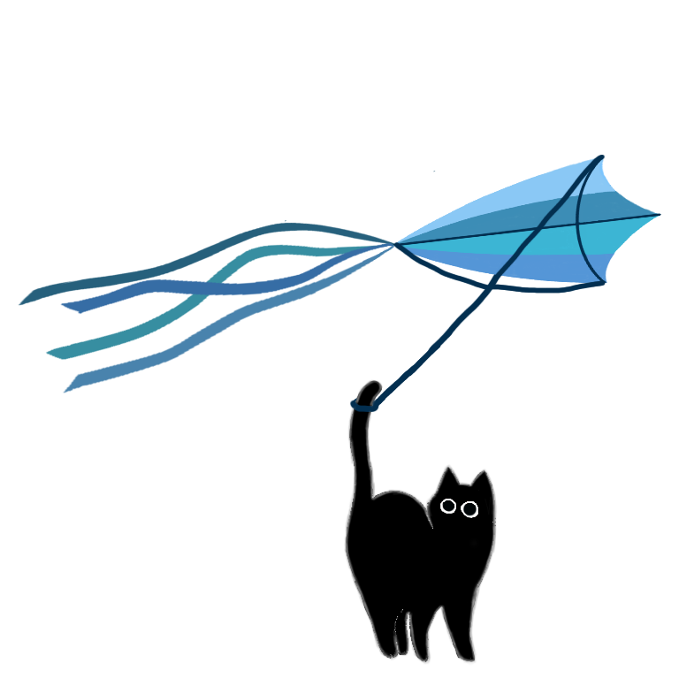
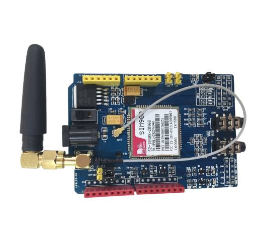
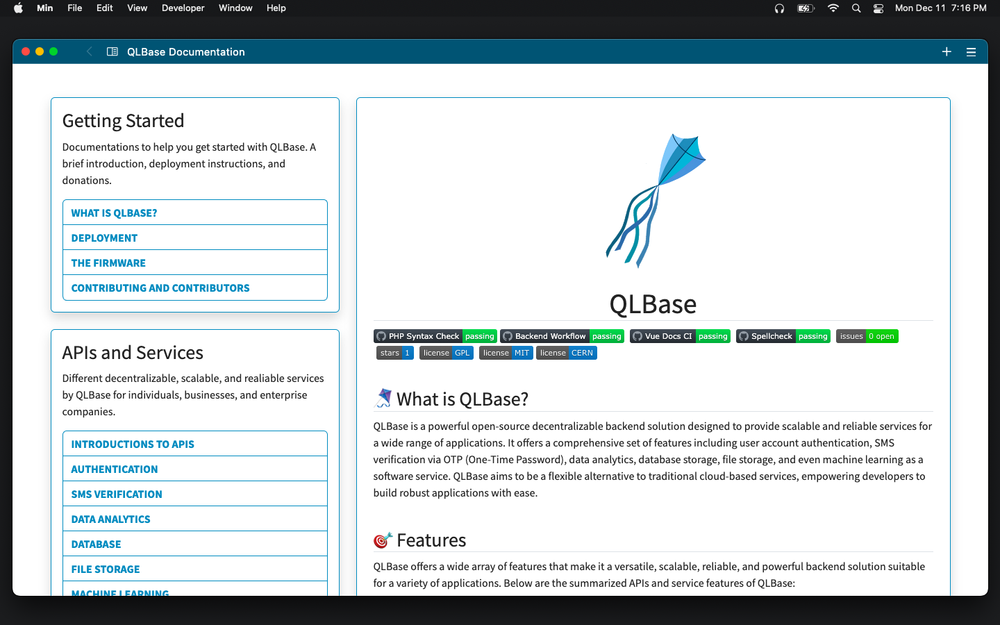
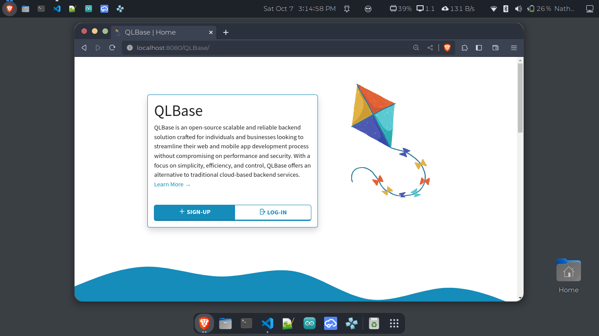
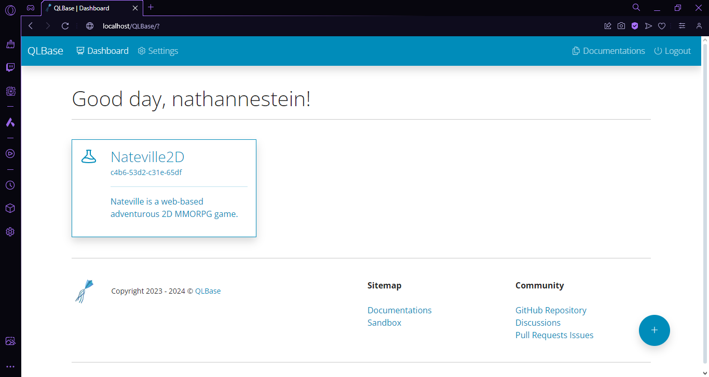
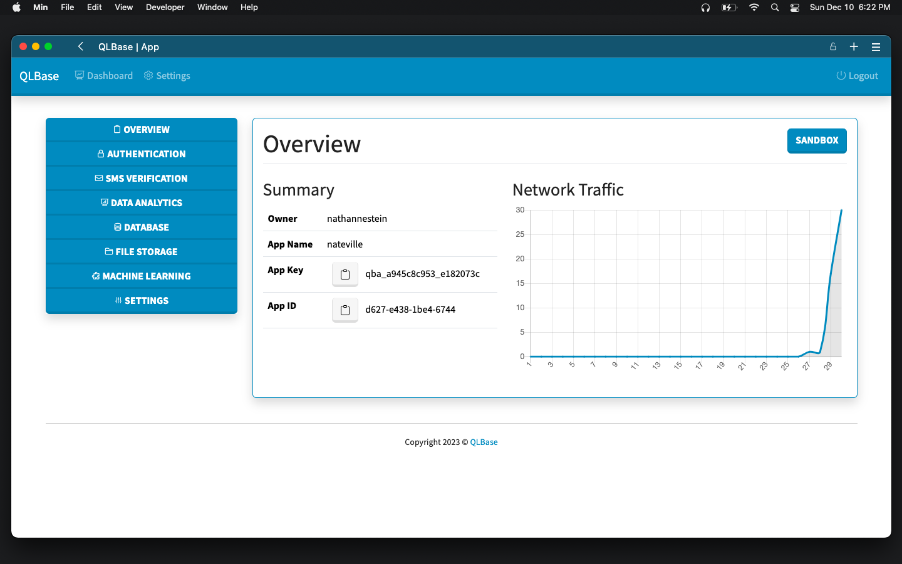
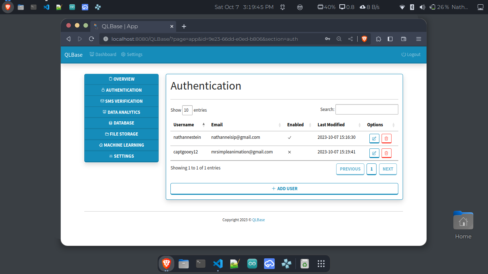
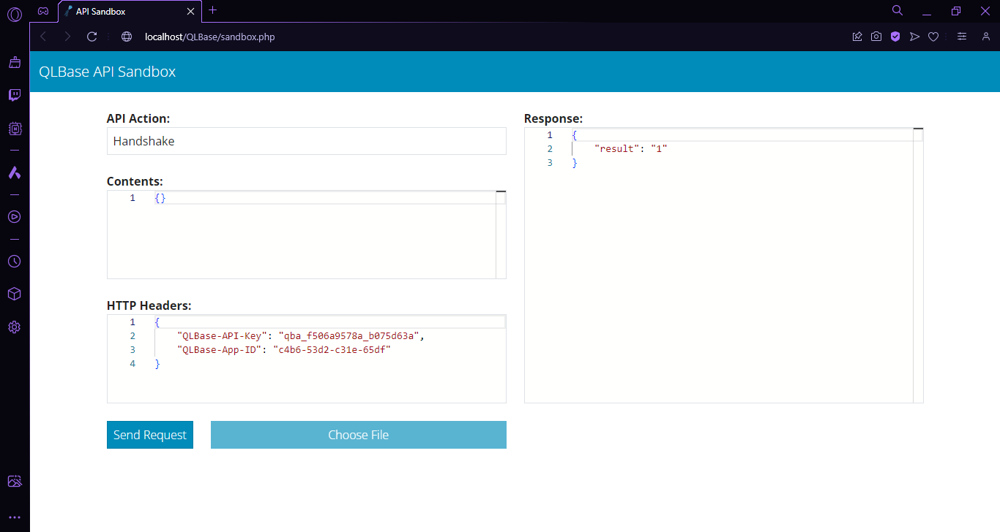

<p align="center">
    
    <h1 align="center">QLBase</h1>
</p>


[](https://github.com/nthnn/QLBase)
[](https://github.com/nthnn/QLBase/issues)
[](https://github.com/nthnn/QLBase/stargazers)

[](https://github.com/nthnn/QLBase/blob/main/LICENSE)
[](https://github.com/nthnn/QLBase/blob/main/LICENSE)
[](https://github.com/nthnn/QLBase/blob/main/LICENSE)
<a href="https://www.buymeacoffee.com/nthnn"></a>

## 🪁 What is QLBase?

QLBase is a powerful open-source decentralizable backend solution designed to provide scalable and reliable services for a wide range of applications. It offers a comprehensive set of features including user account authentication, SMS verification via OTP (One-Time Password), data analytics, database storage, and even file storage as a software service. QLBase aims to be a flexible alternative to traditional cloud-based services, empowering developers to build robust applications with ease.

## 𝌞 Table of Contents



- [🪁 What is QLBase?](#-what-is-qlbase)
- [🎯 Features](#-features)
- [🚀 Deployment](#-deployment)
    * [💼 Software Requirements](#-software-requirements)
    * [📥 Downloading the Repository](#-downloading-the-repository)
    * [🏗️ Building from Source](#%EF%B8%8F-building-from-source)
- [💿 Firmware](#-firmware)
    * [⚡ Components](#-components)
    * [🔧 Hardware Setup](#-hardware-setup)
    * [📡 Uploading the Firmware](#-uploading-the-firmware)
- [🤝 Contributing and Contributors](#-contributing-and-contributors)
    * [🐞 Issue Reporting](#-issue-reporting)
    * [🛠️ Pull Requests](#-pull-requests)
    * [👥 Contributors](#-contributors)
- [📷 Screenshots](#-screenshots)
- [💙 Donating](#-donating)
- [⭐️ Star History](#-star-history)
- [📜 License](#-license)

## 🎯 Features

QLBase offers a wide array of features that make it a versatile, scalable, reliable, and powerful backend solution suitable for a variety of applications. Below are the summarized APIs and service features of QLBase:

- **Authentication**: QLBase provides a robust authentication system that allows you to manage user accounts securely.
- **SMS Verification**: Easily integrate SMS verification into your application using QLBase's OTP service. Protect your user accounts with one-time passwords sent via SMS. QLBase provides SMS verification functionality using an Arduino UNO with a SIM900 Shield as the underlying SMS hardware.
- **Data Analytics**: QLBase includes powerful data analytics capabilities, enabling you to identify, track, and page data efficiently. QLBase offers data analytics identification, tracking, paging, and even making aliases for both registered users and anonymous guess.
- **Database**: Store and manage your data in QLBase's scalable and reliable database storage. Key features of QLBase's database storage include
- **File Storage**: QLBase simplifies file management within your application. QLBase file storage API service offers: file uploads, file retrievals, and access controls.

## 🚀 Deployment


Deploying QLBase is a straightforward and hassle-free process that can be executed on virtually any system, provided it possesses the capability to run both the Apache and MySQL server, two fundamental components for QLBase to operate seamlessly.

To initiate the deployment, all you need to do is follow the comprehensive instructional guide outlined below, ensuring that each step is executed with precision and attention to detail.

The user-friendly nature of QLBase's deployment procedure, combined with the clear and concise instructions, makes it accessible even for those with limited technical expertise, ensuring a smooth and successful setup on your system.

### 💼 Software Requirements

QLBase requires several software from downloading its repository to building and running.

- [Git](https://git-scm.com/) — Free and open source distributed version control system designed to handle everything.
- [Go Compiler](https://go.dev/) — Open-source programming language supported by Google.
- [Qrepo](https://github.com/nthnn/Qrepo) - Simple and easy-to-use all-for-one build tool for Windows, Linux, and macOS.
- [NodeJS](https://nodejs.org/en) — An open-source, cross-platform JavaScript runtime environment.
- [XAMPP](https://www.apachefriends.org/) — Completely free, easy to install Apache distribution containing MariaDB, PHP, and Perl.

### 📥 Downloading the Repository

Open any terminal on your system and then follow the steps below:

1. Clone the QLBase repository from GitHub.

    ```bash
    git clone https://github.com/nthnn/QLBase
    ```

2. Change the working directory to the cloned folder.

    ```bash
    cd QLBase
    ```

If nothing went wrong, you have now downloaded the QLBase repository and should proceed to the section below.

### 🏗️ Building from Source

To simplify the deployment process of QLBase, a `deploy.sh` bash script is provided. This script is designed to package all the deployment-important files and assets and builds the back-end apps, ensuring a smooth deployment experience.

1. Ensure your Go compiler and NodeJS installation first before proceeding.

    ```bash
    go version
    node -v
    ```

2. Before running the deployment Bash script, it is important to set the appropriate file permissions first. It can be done by typing the following:

    ```bash
    sudo chmod -R 777 ./deploy.sh
    ```

3. Now, run the deployment script and wait for it to finish. This script will build all the back-end software, documentations, and will compile all necessary files into a zip file output.

    ```
    ./deploy.sh
    ```

    If it runs successfully, it will generate a zip file named qlbase.zip. Extract this zip file to the root of your Apache server and proceed to the next step.

4. Open the file named `config.ini` inside the folder bin. The file contains the following configurations:

    ```ini
    [database]
    server=localhost
    username=root
    password=
    name=qlbase_apps
    port=3306

    [smtp]
    host=<smtp host>
    port=<smtp port>
    from=<smtp email>
    password=<smtp password>

    [env]
    home=http://localhost:8080/QLBase
    sms=enabled
    sms_serial=/dev/ttyUSB0
    timezone=Asia/Manila
    ```

    The database section defines the MySQL server, username, password, database name, and the server port. While the SMTP server defines the host address/name, server port, from (email address of origin), and password; this SMTP configuration will be used as email gateway for recovering forgotten passwords of users. The SMS service enability can also be configured with either "enabled" or "disabled" value. And lastly, the environment section defines the root URL of the current QLBase runtime.

5. On UNIX-based and UNIX-like operating systems (such as Linux and OSX), you are required to change the permissions of binary files inside the `bin` folder. Changing permissions can be done by opening the bin folder in the terminal and typing the following:

    ```bash
    sudo chmod -R 777 .
    ```

6. Go back to the cloned folder of QLBase and look for the file named db.sql. Copy its contents and then paste and execute it to your MySQL server's terminal.

7. Cheers! 🥂 You can now open and enjoy your installed QLBase decentralized server!

## 💿 Firmware

The SMS OTP feature in QLBase is of utmost importance, providing a secure user authentication method through one-time passwords sent via SMS. In the following sections, you'll discover an in-depth look at the firmware, complete with setup instructions to make integration a smooth process.

### ⚡ Components

The SMS OTP (Short Message Service One-Time Password) firmware, an integral part of the QLBase system, relies on a concise and efficient hardware setup. This essential framework necessitates the utilization of just two key components, namely the Arduino UNO development board and the SIM900 GSM/GPRS UNO Shield.

| Arduino UNO board                                    | SIM900 Shield                                            |
|------------------------------------------------------|----------------------------------------------------------|
|          |          |

The Arduino Uno board is a popular and versatile microcontroller platform that serves as a foundation for countless DIY electronics projects. Developed by Arduino, an open-source hardware and software community, the Uno is designed for both beginners and experienced electronics enthusiasts, making it an ideal choice for those looking to learn, experiment, and prototype with microcontrollers.

While, the SIM900 GSM/GPRS Uno Shield is a specialized add-on module designed to work in conjunction with Arduino Uno and compatible microcontroller boards. This shield enables wireless communication over the Global System for Mobile Communications (GSM) and General Packet Radio Service (GPRS) networks, making it a valuable tool for projects that require remote data transmission, SMS messaging, and internet connectivity.

### 🔧 Hardware Setup

Before you can upload the firmware, you need to set up your development environment and configure the Arduino UNO with the SIM900 shield. Ensure that you have an Arduino UNO and a SIM900 shield. Connect the SIM900 shield to the Arduino UNO, and make sure the following pin connections below are in accordance:

| Arduino UNO | SIM900 Shield |
|-------------|---------------|
| 5V          | 5V            |
| GND         | GND           |
| D7          | RX            |
| D8          | TX            |

For more information about using the SIM900 GSM/GPRS shield, please refer to this [article](https://lastminuteengineers.com/sim900-gsm-shield-arduino-tutorial/).

### 📡 Uploading the Firmware

In this crucial steps, we will guide you through the process of uploading the SMS OTP firmware to your Arduino UNO with the SIM900 shield. This action is pivotal for enabling secure user authentication through SMS OTP for QLBase.

1. Begin by installing [Visual Studio Code](https://code.visualstudio.com/), a versatile and powerful integrated development environment (IDE).
2. Install the [PlatformIO](https://platformio.org/) extension for Visual Studio Code.
3. Open the [sms-otp-firmware](/sms-otp-firmware) folder inside the QLBase in Visual Studio Code using the PlatformIO extension.
4. Configure your SIM900 power source and wait for it to blink every 3 seconds.
5. Use PlatformIO to build and upload the firmware to your Arduino UNO with the SIM900 shield by clicking the upload button at the lower left bottom bar of the Visual Studio Code.

After following these steps, you can now connect the Arduino UNO to your computer where the QLBase is running to use the SMS-OTP API service.

## 🤝 Contributing and Contributors

All contributions are welcome to make QLBase even better. Whether you want to report a bug, suggest new features, or contribute code, your contributions are highly appreciated.

### 🐞 Issue Reporting

If you come across a bug, have a feature request, or wish to propose enhancements, we kindly encourage you to initiate the process by opening an issue on our [GitHub Issue Tracker](https://github.com/nthnn/QLBase/issues). Your feedback is invaluable in helping us refine and enhance the QLBase. To ensure we can address your concern effectively, we kindly request that you include as much pertinent information as possible. This may encompass a detailed description of the issue or feature request, and if applicable, specific steps to replicate the problem.

Your thorough input enables us to better understand and resolve the matter swiftly, contributing to the overall improvement of QLBase. Thank you for your contributions and for helping us create a more robust and user-friendly environment.

### 🛠️ Pull Requests

If you're eager to get involved and contribute your coding expertise to QLBase, we're thrilled to have you on board! To ensure a smooth and collaborative process, here's an outlined the following steps that you can follow:

1. Fork the QLBase repository to your GitHub account. And then clone it to your local machine.

    ```bash
    git clone https://github.com/<your username>/QLBase.git
    ```

2. Create a new branch for your changes:

    ```bash
    git checkout -b feature/<your feature name>
    ```

3. You can now make changes to the repository.
4. Commit your changes:

    ```bash
    git add -A
    git commit -m "Add your meaningful commit message here"
    ```

5. Push your changes to your forked repository:

    ```bash
    git push origin feature/<your feature name>
    ```

6. Create a pull request (PR) from your branch to the main branch of the QLBase repository.
7. Your PR will be reviewed, and any necessary changes will be discussed and implemented.
8. Once your PR is approved, it will be merged into the main branch, and your contribution will be part of QLBase.

### 👥 Contributors

Finally, this section acknowledges and celebrates the individuals who have made significant contributions to the development and success of the project. Meet the dedicated and talented team members, developers, and collaborators who have played key roles in bringing QLBase to life and advancing its objectives.

- [Nathanne Isip](https://github.com/nthnn) — Original Author, Developer
- [Lady Selene](https://instagram.com/lady.selenee) — Artist, Illustrator

## 📷 Screenshots

| <p align="center">QLBase Documentations</p>          |
|------------------------------------------------------|
|  |

| <p align="center">QLBase Homepage</p>                |
|------------------------------------------------------|
|  |

| <p align="center">Application Dashboard</p>          |
|------------------------------------------------------|
|  |

| <p align="center">Application Overview</p>           |
|------------------------------------------------------|
|  |

| <p align="center">Data Analytics Tab</p>         |
|------------------------------------------------------|
|  |

| <p align="center">QLBase API Sandbox</p>             |
|------------------------------------------------------|
|  |

## 💙 Donating

QLBase is an open-source project and is voluntarily developed. If you find QLBase useful and would like to support its continued development and improvement, you can make a donation.

| [](https://paypal.me/nathannestein) | [](https://www.buymeacoffee.com/nthnn) |
|-------------------|----------------------------|

QLBase developers are profoundly grateful for your support! Your generosity allows us to continue developing and maintaining QLBase, making it better with each update. Your contribution is not just a donation; it's a vote of confidence in the project and a testament to the strength of the open-source community. Your contribution will help cover fund new features and support the community and developers (?) behind QLBase.

## ⭐️ Star History

<a href="https://star-history.com/#nthnn/QLBase&Date">
  <picture>
    <source media="(prefers-color-scheme: dark)" srcset="https://api.star-history.com/svg?repos=nthnn/QLBase&type=Date&theme=dark" />
    <source media="(prefers-color-scheme: light)" srcset="https://api.star-history.com/svg?repos=nthnn/QLBase&type=Date" />
    
  </picture>
</a>

## 📜 License

The use of QLBase is governed by the terms and conditions of MIT License. It's important to adhere to these licensing requirement when using or distributing QLBase components. The entire QLBase system, including the server-side, back-end, and the source files for the Arduino firmware used in the SMS service, is licensed under the [MIT License](LICENSE).

<p align="center">
    <a href="https://app.fossa.io/projects/git%2Bgithub.com%2Fnthnn%2FQLBase?ref=badge_large">
        
    </a>
</p>