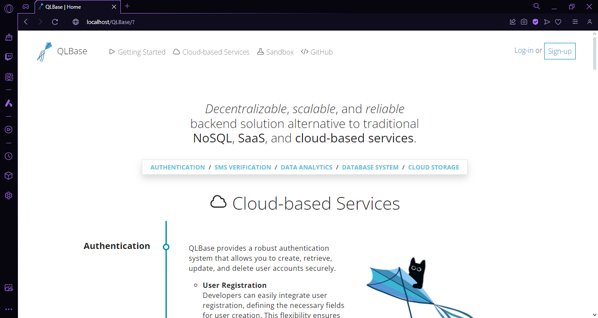
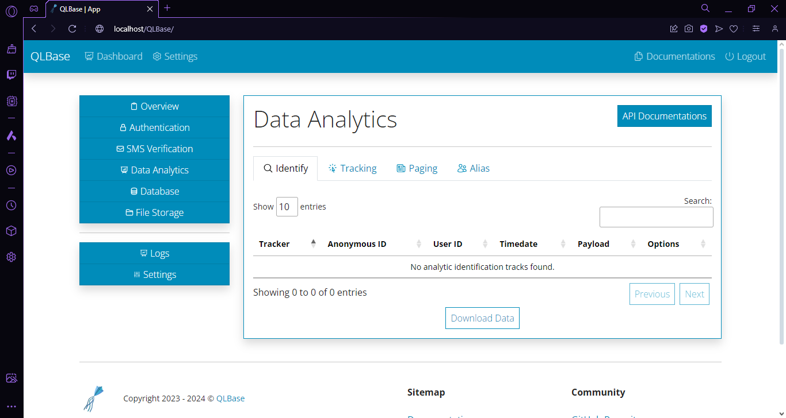

<p align="center">
    
    <h1 align="center">QLBase</h1>
</p>

[](https://github.com/nthnn/QLBase/blob/main/LICENSE)
[](https://github.com/nthnn/QLBase/stargazers)
[](https://github.com/nthnn/QLBase/issues)

QLBase is a powerful open-source backend solution designed to provide scalable and reliable services for a wide range of applications. It offers a comprehensive set of features including user account authentication, SMS verification via OTP (One-Time Password), data analytics, database storage, file storage, and even machine learning as a software service. QLBase aims to be a flexible alternative to traditional cloud-based services, empowering developers to build robust applications with ease.

> Note: QLBase is a work-in-progress.

## Table of Contents

- [Features](#features)
- [Screenshots](#screenshots)

## Features

QLBase offers a wide array of features that make it a versatile and powerful backend solution suitable for a variety of applications:

### Authentication

QLBase provides a robust authentication system that allows you to manage user accounts securely. It includes:

- **User Registration**: Easily register new users with customizable registration fields.

    ```
    api?api_key=<API key>
        &app_id=<app ID>
        &action=new_user
        &username=<username>
        &email=<email>
        &password=<MD5 hashed string>
        &enabled=0|1
    ```

    ```js
    {"result": "1"}
    // Successfully registered
    ```

- **Login**: Enable users to log in securely, supporting various authentication methods, including username/password and social logins.

    ```
    api?api_key=<API key>
        &app_id=<app ID>
        &action=login_username
        &username=<username>
        &password=<MD5 hashed string>
    ```

    ```js
    {"result": "0", "value": "0"}
    // Invalid login credentials
    ```

- **Account Disabling/Enabling**: You can disable and enable user accounts as needed. When an account is disabled, the user cannot log in until it's enabled again. This feature is particularly useful for handling suspicious or inactive accounts.

    ```
    api?api_key=<API key>
        &app_id=<app ID>
        &action=disable_user
        &username=<username>
    ```

    ```js
    {"result": "1"}
    // User was disabled
    ```

### SMS Verification

Easily integrate SMS verification into your application using QLBase's OTP service. Protect your user accounts with one-time passwords sent via SMS. QLBase provides SMS verification functionality using an Arduino UNO with a SIM900 Shield as the underlying SMS hardware. This setup allows you to seamlessly integrate SMS verification into your application for added security. QLBase's SMS verification features include:

- **OTP Generation**: Generate one-time passwords for user verification.

    ```
    api?api_key=<API key>
        &app_id=<app ID>
        &action=sms_verification
        &recipient=+639xxxxxxxxxxx
        &support=techsupport@example.com
    ```

    ```js
    {"result": "1", "value": "723181"}
    // The SMS was sent, and the OTP is 723181
    ```

- **SMS Delivery**: Send SMS messages containing OTPs to users' mobile numbers.

    ```
    api?api_key=<API key>
        &app_id=<app ID>
        &action=sms_is_validated
        &recipient=+639xxxxxxxxxxx
        &code=723181
    ```

    ```js
    {"result": "1", "value": "0"}
    // The OTP wasn't verified yet
    ```

- **Verification Endpoint**: Create an endpoint for users to enter OTPs and verify their phone numbers.

    ```
    api?api_key=<API key>
        &app_id=<app ID>
        &action=sms_validate
        &recipient=+639xxxxxxxxxxx
        &code=723181
    ```

    ```js
    {"result": "1"}
    // The OTP was successfully verified
    ```

### Data Analytics

QLBase includes powerful data analytics capabilities, enabling you to identify, track, and page data efficiently. It offers:

- **Data Identification**: QLBase allows you to tie user actions to specific individuals or anonymous IDs, making it easier to track and analyze user behavior.
- **Data Tracking**: Track user interactions and behaviors within your application for insightful analytics.
- **Data Paging**: Implement efficient data paging to handle large datasets without performance bottlenecks.

### Database Storage

Store and manage your data in QLBase's scalable and reliable database storage. Key features of QLBase's database storage include:

- **CRUD Operations**: Perform Create, Read, Update, and Delete operations on your data.
- **Data Validation**: Ensure data integrity with built-in validation mechanisms.

### File Storage

QLBase simplifies file management within your application. Its file storage service offers:

- **File Uploads**: Easily upload files, including images, documents, and media, with support for various file types.
- **File Retrieval**: Retrieve files securely using unique file identifiers.
- **Access Control**: Implement access control and permissions to restrict file access as needed.

### Machine Learning

Leverage machine learning as a software service through QLBase. Integrate AI capabilities into your applications without the hassle of managing complex infrastructure. QLBase's machine learning features include:

- **Model Integration**: Seamlessly integrate pre-trained machine learning models for tasks like image recognition, natural language processing, and more.
- **Custom Model Training**: Train and deploy custom machine learning models tailored to your specific application needs.
- **Scalable Infrastructure**: QLBase handles the scalability and deployment of machine learning models, ensuring high availability and performance.

### Security

Security is a top priority in QLBase:

- **Authentication Security**: Implement best practices for secure user authentication, including password hashing and protection against common attacks like CSRF and XSS.
- **Data Encryption**: Encrypt sensitive data to ensure confidentiality and integrity.

> Note: There are more API actions than the examples given above.

## Screenshots

| <p align="center">QLBase Homepage</p>                |
|------------------------------------------------------|
|  |

| <p align="center">Application Dashboard</p>          |
|------------------------------------------------------|
|  |

| <p align="center">Application Overview</p>           |
|------------------------------------------------------|
|  |

| <p align="center">User Authetication Tab</p>         |
|------------------------------------------------------|
|  |

## License

Your use of QLBase is subject to the terms and conditions of the following respective licenses. Make sure to comply with the licensing requirements when using or distributing QLBase components.

- The server-side code of QLBase is licensed under the [MIT License](LICENSE/MIT%20Public%20License.txt).
- The back-end software components used in QLBase are licensed under the [GNU GPL v3.0 License](LICENSE/GNU%20GPL%20v3.0.txt). Refer to the individual licenses of those components for specific details. And;
- The Arduino firmware in QLBase's SMS hardware is licensed under the [CERN OHL Permissive v2](LICENSE/CERN%20OHL%20Permissive%20v2.txt). Please review the firmware's licensing documentation for further information.