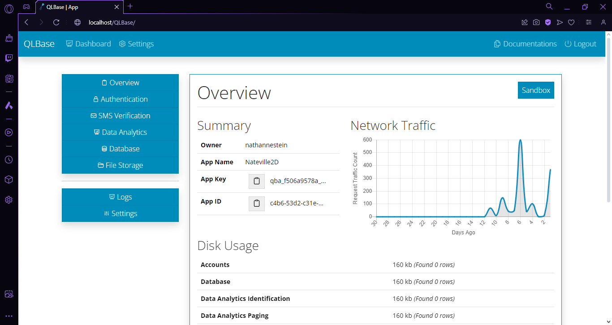

<p align="center">
    
    <h1 align="center">QLBase</h1>
</p>


[](https://github.com/nthnn/QLBase/issues)
[](https://github.com/nthnn/QLBase/stargazers)
[](https://github.com/nthnn/QLBase/blob/main/LICENSE)
[](https://github.com/nthnn/QLBase/blob/main/LICENSE)
[](https://github.com/nthnn/QLBase/blob/main/LICENSE)
<a href="https://www.buymeacoffee.com/nthnn"></a>

## 🪁 What is QLBase?

QLBase is a powerful open-source decentralizable backend solution designed to provide scalable and reliable services for a wide range of applications. It offers a comprehensive set of features including user account authentication, SMS verification via OTP (One-Time Password), data analytics, database storage, file storage, and even machine learning as a software service. QLBase aims to be a flexible alternative to traditional cloud-based services, empowering developers to build robust applications with ease.

## 🎯 Features

QLBase offers a wide array of features that make it a versatile, scalable, reliable, and powerful backend solution suitable for a variety of applications. Below are the summarized APIs and service features of QLBase:

- **Authentication**: QLBase provides a robust authentication system that allows you to manage user accounts securely.
- **SMS Verification**: Easily integrate SMS verification into your application using QLBase's OTP service. Protect your user accounts with one-time passwords sent via SMS. QLBase provides SMS verification functionality using an Arduino UNO with a SIM900 Shield as the underlying SMS hardware.
- **Data Analytics**: QLBase includes powerful data analytics capabilities, enabling you to identify, track, and page data efficiently. QLBase offers data analytics identification, tracking, paging, and even making aliases for both registered users and anonymous guess.
- **Database**: Store and manage your data in QLBase's scalable and reliable database storage. Key features of QLBase's database storage include
- **File Storage: QLBase simplifies file management within your application. QLBase file storage API service offers: file uploads, file retrievals, and access controls.
- **Machine Learning**: Leverage machine learning as a software service through QLBase. Integrate AI capabilities into your applications without the hassle of managing complex infrastructure. QLBase's machine learning features inclues model integration, custom model training, and scalable infrastructure.

## 🚀 Deployment

Deploying QLBase is a straightforward and hassle-free process that can be executed on virtually any system, provided it possesses the capability to run both the Apache and MySQL server, two fundamental components for QLBase to operate seamlessly.

To initiate the deployment, all you need to do is follow the comprehensive instructional guide outlined below, ensuring that each step is executed with precision and attention to detail.

The user-friendly nature of QLBase's deployment procedure, combined with the clear and concise instructions, makes it accessible even for those with limited technical expertise, ensuring a smooth and successful setup on your system.

### 💼 Software Requirements

QLBase requires several softwares from downloading its repository to building and running.

- [Git](https://git-scm.com/) — Free and open source distributed version control system designed to handle everything.
- [Go Compiler](https://go.dev/) — Open-source programming language supported by Google.
- [NodeJS](https://nodejs.org/en) — An open-source, cross-platform JavaScript runtime environment.
- [XAMPP](https://www.apachefriends.org/) — Completely free, easy to install Apache distribution containing MariaDB, PHP, and Perl.

### 📥 Downloading the Repository

Open any terminal on your system and then follow the steps below:

1. Clone the QLBase repository from GitHub.

    ```bash
    git clone https://github.com/nthnn/QLBase
    ```

2. Change the working directory to the cloned folder.

    ```bash
    cd QLBase
    ```

If nothing went wrong, you have now downloaded the QLBase repository and should proceed to the section below.

### 🏗️ Building from Source

To simplify the deployment process of QLBase, a `deploy.sh` bash script is provided. This script is designed to package all the deployment-important files and assets and builds the back-end apps, ensuring a smooth deployment experience.

1. Ensure your Go compiler and NodeJS installation first before proceeding.

    ```bash
    go version
    node -v
    ```

2. Before running the deployment Bash script, it is important to set the appropriate file permissions first. It can be done by typing the following:

    ```bash
    sudo chmod -R 777 ./deploy.sh
    ```

3. Now, run the deployment script and wait for it to finish. This script will build all the back-end softwares, documentations, and will compile all necessary files into a zip file output.

    ```
    ./deploy.sh
    ```

    If it runs successfully, it will generate a zip file named qlbase.zip. Extract this zip file to the root of your Apache server and proceed to the next step.

4. Open the file named `config.ini` inside the folder bin. The file contains the following configurations:

    ```ini
    [database]
    server=localhost
    username=root
    password=
    name=qlbase_apps
    port=3306

    [smtp]
    host=<smtp host>
    port=<smtp port>
    from=<smtp email>
    password=<smtp password>

    [env]
    home=http://localhost:8080/QLBase
    ```

    The database setion defines the MySQL server, username, password, database name, and the server port. While the SMTP server defines the host address/name, server port, from (email address of origin), and password; this SMTP configuration will be used as email gateway for recovering forgotten passwords of users. And lastly, the environment section defines the root URL of the current QLBase runtime.

5. On UNIX-based and UNIX-like operating systems (such as Linux and OSX), you are required to change the permissions of binary files inside the `bin` folder. Changing permissions can be done by opening the bin folder in the terminal and typing the following:

    ```bash
    sudo chmod -R 777 .
    ```

6. Go back to the cloned folder of QLBase and look for the file named db.sql. Copy its contents and then paste and execute it to your MySQL server's terminal.

7. Cheers! 🥂 You can now open and enjoy your installed QLBase decentralized server!

## 💿 Firmware

The SMS OTP feature in QLBase is of utmost importance, providing a secure user authentication method through one-time passwords sent via SMS. In the following sections, you'll discover an in-depth look at the firmware, complete with setup instructions to make integration a smooth process.

### ⚡ Components

The SMS OTP (Short Message Service One-Time Password) firmware, an integral part of the QLBase system, relies on a concise and efficient hardware setup. This essential framework necessitates the utilization of just two key components, namely the Arduino UNO development board and the SIM900 GSM/GPRS UNO Shield.

| Arduino UNO board                                    | SIM900 Shield                                            |
|------------------------------------------------------|----------------------------------------------------------|
|          |          |

The Arduino Uno board is a popular and versatile microcontroller platform that serves as a foundation for countless DIY electronics projects. Developed by Arduino, an open-source hardware and software community, the Uno is designed for both beginners and experienced electronics enthusiasts, making it an ideal choice for those looking to learn, experiment, and prototype with microcontrollers.

While, the SIM900 GSM/GPRS Uno Shield is a specialized add-on module designed to work in conjunction with Arduino Uno and compatible microcontroller boards. This shield enables wireless communication over the Global System for Mobile Communications (GSM) and General Packet Radio Service (GPRS) networks, making it a valuable tool for projects that require remote data transmission, SMS messaging, and internet connectivity.

### 🔧 Hardware Setup

Before you can upload the firmware, you need to set up your development environment and configure the Arduino UNO with the SIM900 shield. Ensure that you have an Arduino UNO and a SIM900 shield. Connect the SIM900 shield to the Arduino UNO, and make sure the following pin connections below are in accordance:

| Arduino UNO | SIM900 Shield |
|-------------|---------------|
| 5V          | 5V            |
| GND         | GND           |
| D7          | RX            |
| D8          | TX            |

For more informations about using the SIM900 GSM/GPRS shield, please refer to this [article](https://lastminuteengineers.com/sim900-gsm-shield-arduino-tutorial/).

### 📡Uploading the Firmware

In this crucial steps, we will guide you through the process of uploading the SMS OTP firmware to your Arduino UNO with the SIM900 shield. This action is pivotal for enabling secure user authentication through SMS OTP for QLBase.

1. Begin by installing [Visual Studio Code](https://code.visualstudio.com/), a versatile and powerful integrated development environment (IDE).
2. Install the [PlatformIO](https://platformio.org/) extension for Visual Studio Code.
3. Open the [sms-otp-firmware](/sms-otp-firmware) folder inside the QLBase in Visual Studio Code using the PlatformIO extension.
4. Configure your SIM900 power source and wait for it to blink every 3 seconds.
5. Use PlatformIO to build and upload the firmware to your Arduino UNO with the SIM900 shield by clicking the upload button at the lower left bottom bar of the Visual Studio Code.

After following these steps, you can now connect the Arduino UNO to your computer where the QLBase is running to use the SMS-OTP API service.

## 💙 Donating

QLBase is an open-source project and is voluntarily developed. If you find QLBase useful and would like to support its continued development and improvement, you can make a donation.

| [](https://paypal.me/nathannestein) | [](https://www.buymeacoffee.com/nthnn) |
|-------------------|----------------------------|

QLBase developers are profoundly grateful for your support! Your generosity allows us to continue developing and maintaining QLBase, making it better with each update. Your contribution is not just a donation; it's a vote of confidence in the project and a testament to the strength of the open-source community. Your contribution will help cover fund new features and support the community and developers (?) behind QLBase.

## 📷 Screenshots

| <p align="center">QLBase Homepage</p>                |
|------------------------------------------------------|
|  |

| <p align="center">Application Dashboard</p>          |
|------------------------------------------------------|
|  |

| <p align="center">Application Overview</p>           |
|------------------------------------------------------|
|  |

| <p align="center">User Authetication Tab</p>         |
|------------------------------------------------------|
|  |

| <p align="center">QLBase API Sandbox</p>             |
|------------------------------------------------------|
|  |

## 📜 License

Your use of QLBase is subject to the terms and conditions of the following respective licenses. Make sure to comply with the licensing requirements when using or distributing QLBase components.

- The server-side code of QLBase is licensed under the [MIT License](LICENSE/MIT%20Public%20License.txt).
- The back-end software components used in QLBase are licensed under the [GNU GPL v3.0 License](LICENSE/GNU%20GPL%20v3.0.txt). Refer to the individual licenses of those components for specific details. And;
- The Arduino firmware in QLBase's SMS hardware is licensed under the [CERN OHL Permissive v2](LICENSE/CERN%20OHL%20Permissive%20v2.txt). Please review the firmware's licensing documentation for further information.