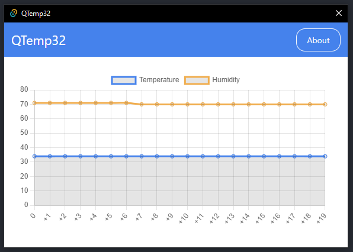

# QTemp32

Demo temperature recording with ESP32 and DHT11 using QLBase.

<p align="center">
    
</p>

## Firmware Libraries Used

The list below are the libraries installed to compile the [firmware.ino](firmware/firmware.ino) within the Arduino IDE for ESP32.

- [bblanchon/ArduinoJson](https://github.com/bblanchon/ArduinoJson) - JSON library for Arduino and embedded C++. Simple and efficient.
- [nthnn/DynaConfig](https://github.com/nthnn/DynaConfig) - Arduino WiFi dynamic configuration library for ESP32 using captive portal authentication.
- [DFRobot/DFRobot_DHT11](https://github.com/DFRobot/DFRobot_DHT11) - DHT11 is used to read the temperature and humidity of the current environment.

## Building the app

To get started building the app, just run the following commands:

```bash
cd app/QTemp32
npm install
npm run tauri build --release
```
